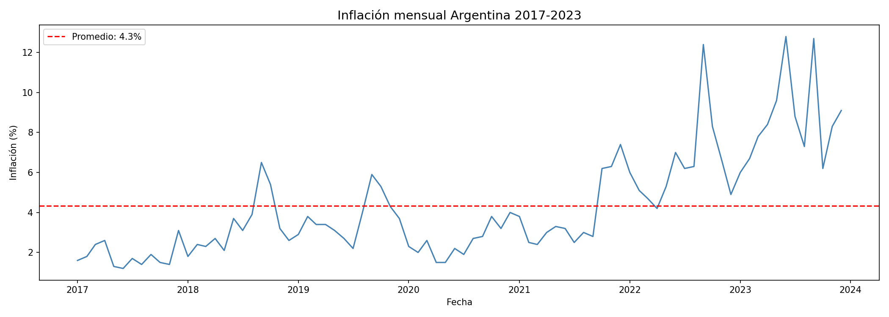
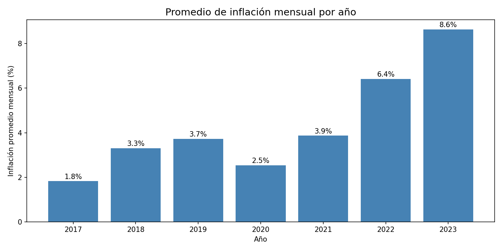
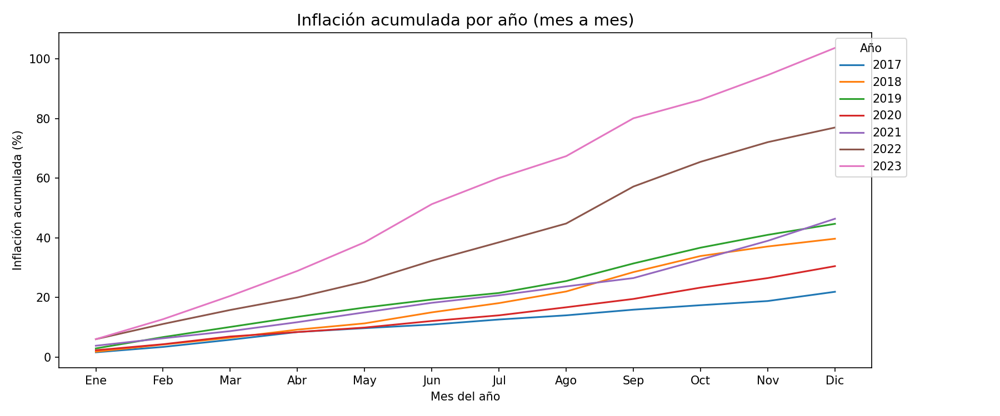

# Argentina Inflation Analysis (2017-2023)

Exploratory data analysis (EDA) of Argentina's monthly inflation using official INDEC data.

## Tools
- Python (pandas, matplotlib, seaborn)
- Google Colab / Jupyter Notebook

## What's included
- Data cleaning and structuring
- Monthly inflation time series
- Yearly average comparison
- Year-over-year cumulative inflation

## Key findings
- Average monthly inflation for the period: 4.3%
- Highest monthly inflation: June 2023 (12.8%)
- 2023 was the first year to exceed 100% annual cumulative inflation
- Sustained acceleration observed since 2021

## Visualizations

---
*Análisis exploratorio de la inflación argentina con Python y pandas. Datos: INDEC.*
